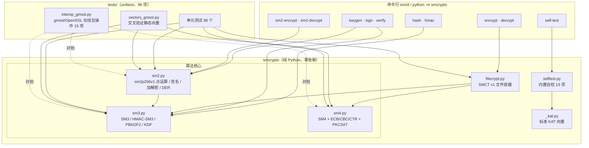

# 国密算法工具箱（sm-crypto-toolbox）

[](https://github.com/wangzhao-cs/sm-crypto-toolbox/actions/workflows/ci.yml)
[](https://github.com/wangzhao-cs/sm-crypto-toolbox)
[](https://github.com/wangzhao-cs/sm-crypto-toolbox)
[](./LICENSE)

> 纯 Python 从零实现国密算法工具箱：**SM2 / SM3 / SM4** + 文件加密与签名 CLI + 与 gmssl/OpenSSL 的交叉验证，
> **零第三方依赖**（仅标准库），代码可读、向量可查、数字可复现。

## 背景

国密（商用密码）算法是我国自主可控的密码算法体系，已发布为国家标准（GB/T）与密码行业标准（GM/T）。
在信创、金融、政务、物联网等国产化场景中，SM 系列算法是 TLS 国密改造、数据安全合规的基础设施。
本项目以**教学与工程验证**为目的，从零实现核心算法并做**独立交叉验证**，
既可作为学习国密算法细节的参考实现，也可作为工具箱日常使用。

| 标准 | 算法 | 内容 |
| --- | --- | --- |
| GB/T 32905-2016 | **SM3** 密码杂凑算法 | 256 比特分组杂凑，类比 SHA-256 |
| GB/T 32907-2016 | **SM4** 分组密码算法 | 128 比特分组/128 比特密钥，类比 AES |
| GM/T 0003 / GB/T 32918 | **SM2** 椭圆曲线公钥算法 | sm2p256v1 曲线上的签名与公钥加密，类比 ECDSA/ECIES |

## 算法支持

| 模块 | 功能 | 说明 |
| --- | --- | --- |
| **SM3** | 杂凑算法 | 一次性 + 增量式 API（`update`/`digest`/`copy`） |
| | HMAC-SM3 | RFC 2104 结构，与 OpenSSL `mac -digest SM3` 逐字节一致 |
| | PBKDF2-HMAC-SM3 | RFC 8018 口令派生，用于文件加密口令 → 密钥 |
| | KDF（SM3-KDF） | GM/T 0003.4 密钥派生函数，SM2 加解密内部使用 |
| **SM4** | 密钥扩展 + 轮函数 | 32 轮非平衡 Feistel，加解密共用一套轮函数 |
| | 工作模式 | ECB / CBC / CTR（CTR 计数器 128 位大端自增，与 OpenSSL 一致） |
| | 填充 | PKCS#7 填充与**严格校验**去填充（非法填充必报错） |
| **SM2** | 曲线与点运算 | sm2p256v1 仿射坐标点加/倍点/标量乘（双倍-加法） |
| | 密钥 | 密钥对生成（`secrets` 安全随机）、公钥编解码（04 前缀 / 裸 X‖Y） |
| | 签名/验签 | SM2-with-SM3，含 Z_A = SM3(ENTL‖ID_A‖a‖b‖x_G‖y_G‖x_A‖y_A)，ID 默认 `1234567812345678` |
| | 公钥加解密 | C1C3C2（默认）与 C1C2C3 两种排列，KDF 全零重试，C3 完整性校验 |
| | 签名编码 | 裸 r‖s 与 DER（`SEQUENCE{INTEGER r, INTEGER s}`）双向编解码 |
| **CLI** `smctl` | 8+2 个子命令 | `hash` `hmac` `keygen` `sign` `verify` `encrypt` `decrypt` `self-test` + `sm2-encrypt` `sm2-decrypt` |
| **文件加密** | SMCT v1 容器 | magic+版本+算法+salt/IV+密文；口令模式用 PBKDF2-HMAC-SM3（格式见下） |

## 架构



## 安装

要求：Python ≥ 3.9。**运行期零第三方依赖**。

```bash
# 方式一：pip 安装（获取 smctl 命令）
pip install .            # 或 pip install -e . 开发模式

# 方式二：免安装直接运行（源码目录内）
PYTHONPATH=src python -m smcrypto --help
```

交叉验证用依赖（**仅测试期**，不属于运行期依赖）：

```bash
uv pip install gmssl        # 或 pip install gmssl
```

## 快速开始

### 命令行（真实输出，macOS / Python 3.11.15）

```console
$ smctl hash -t abc
66c7f0f462eeedd9d1f2d46bdc10e4e24167c4875cf2f7a2297da02b8f4ba8e0

$ smctl hmac -k secret-key hello.txt
4dda3750b1a895de969473854fdb80e2109d2ca307e096443b34f10613b51976

$ smctl keygen -o demo                      # 私钥 0600 权限写入 demo.sm2key
$ smctl sign --key demo.sm2key hello.txt -o hello.sig
$ smctl verify --pub demo.sm2pub --sig hello.sig hello.txt
验签通过

$ smctl verify --pub demo.sm2pub --sig hello.sig tampered.txt
验签失败                                     # 退出码 1（消息被篡改）

$ smctl encrypt --password '正确密码' --iterations 20000 hello.txt hello.enc
已加密 27 字节 → hello.enc（SM4-CBC，口令模式，PBKDF2 迭代 20000，容器共 76 字节）
$ xxd hello.enc | head -2
00000000: 534d 4354 0101 0100 0000 4e20 c305 5616  SMCT......N ..V.
00000010: 66b3 d587 69c2 c6a5 f707 dd9c dcea cd25  f...i..........%

$ smctl decrypt --password '正确密码' hello.enc hello.dec
已解密 hello.enc → hello.dec（SM4-CBC，明文 27 字节）

$ smctl decrypt --password '错误密码' hello.enc bad.dec
错误：PKCS#7 填充无效：填充字节值 114 越界     # 退出码 1（口令错误被拒绝）

$ smctl sm2-encrypt --pub demo.sm2pub hello.txt hello.sm2
已加密 27 字节 → hello.sm2（SM2，C1C3C2，密文 124 字节）
$ smctl sm2-decrypt --key demo.sm2key hello.sm2 hello.sm2.dec
已解密 hello.sm2 → hello.sm2.dec（SM2，明文 27 字节）
```

完整端到端演示（加密解密 / 签名验签 / 完整性校验 / 自检）：

```bash
bash examples/demo.sh          # 真实执行的输出即上面示例的来源
```

### Python API

```python
from smcrypto import sm3_hexdigest, sm4_cbc_encrypt, sm4_cbc_decrypt
from smcrypto import generate_keypair, sm2_sign, sm2_verify, sm2_encrypt, sm2_decrypt

# SM3
assert sm3_hexdigest(b"abc") == "66c7f0f462eeedd9d1f2d46bdc10e4e24167c4875cf2f7a2297da02b8f4ba8e0"

# SM4-CBC
key = bytes.fromhex("0123456789abcdeffedcba9876543210")
iv = bytes.fromhex("000102030405060708090a0b0c0d0e0f")
ct = sm4_cbc_encrypt(key, iv, b"hello SM4")
assert sm4_cbc_decrypt(key, iv, ct) == b"hello SM4"

# SM2 签名/验签 + 公钥加密
d, pub = generate_keypair()
r, s = sm2_sign(d, b"hello SM2")
assert sm2_verify(pub, b"hello SM2", r, s)
assert sm2_decrypt(d, sm2_encrypt(pub, b"secret")) == b"secret"
```

更多示例见 [`examples/python_api.py`](examples/python_api.py)（`PYTHONPATH=src python examples/python_api.py`）。

### 内置自检

```console
$ smctl self-test
[PASS] SM3 标准向量（GB/T 32905-2016 示例）          ...  3 个标准向量一致
[PASS] SM3 增量式接口 == 一次性接口                  ...  768 字节分 21 次 update 与一次性结果一致
[PASS] HMAC-SM3 ↔ CPython hmac（RFC 2104）          ...  5 组用例与标准库一致
[PASS] PBKDF2-HMAC-SM3 ↔ RFC 8018 参考实现           ...  3 组用例一致
[PASS] SM4 分组标准向量（GB/T 32907-2016 示例）       ...  A.1 示例加解密一致
[PASS] SM4 ECB/CBC/CTR 往返与冻结向量                ...  各 10 种长度 + CBC 冻结向量一致
[PASS] PKCS#7 填充边界与非法填充拒绝                  ...  0..32 字节 + 6 类非法填充被拒
[PASS] SM2 曲线健全性（G 在曲线上、[n]G = O）         ...  [n]G = O（原始标量乘实算）
[PASS] SM2 标准签名示例复现（Z_A/e/r/s）             ...  GB/T 32918.2 附录 A 示例完整复现
[PASS] SM2 签名随机性与篡改拒绝                      ...  4 类篡改全部拒绝
[PASS] SM2 公钥加解密往返（C1C3C2/C1C2C3）           ...  5 长度 × 2 排列 + 篡改拒绝
[PASS] SM2 签名 DER 编解码往返                       ...  4 类非法 DER 被拒绝
[PASS] SMCT 文件容器往返（口令/原始密钥）             ...  3 算法 × 6 长度
------------------------------------------------------------------------
自检结果: 13/13 通过，总耗时 4.9 s
```

`smctl self-test --full` 额外运行 **SM4 100 万次迭代标准向量**（GB/T 32907-2016 A.2），
本机实测 14/14 通过、总耗时 28.2 s（其中 100 万次迭代 23.6 s）。

## 测试与验证

### 运行测试

```bash
# 零安装：核心单元测试 96 项（仓库内已冻结交叉验证向量，无需 gmssl）
python -m unittest discover -s tests -v          # 实测 96 tests / 约 17 s / OK

# 在线交叉验证 15 项（需要 gmssl；本机同时启用 OpenSSL 对拍）
python -m unittest discover -s tests -p "interop_gmssl.py" -v   # 实测 15 tests / 约 1.7 s / OK

# 代码风格检查（ruff，dev 依赖）
ruff check src tests scripts examples                            # All checks passed
```

### 测试统计（本机实测）

| 项目 | 数量 | 耗时 | 环境 |
| --- | --- | --- | --- |
| 单元测试（零依赖） | **96 项全部通过** | 17–21 s | Python 3.11.15 / macOS arm64 |
| 交叉验证测试（gmssl + OpenSSL） | **15 项全部通过** | 约 1.7 s | gmssl 3.2.2 / OpenSSL 3.6.3 |
| 内置自检 | 13/13 通过（`--full` 14/14） | 5.0 s（`--full` 28.2 s） | 同上 |

覆盖要点：分组/填充边界（SM3 55/56/57/63/64/65 字节；SM4 0/1/15/16/17/…）、
曲线健全性（G 在曲线上、`[n]G = O` 真实标量乘验证）、签名随机性与四类篡改拒绝、
加解密往返（含空串与 1 字节最短 SM2 密文）、DER 编解码往返与非法 DER 拒绝、CLI 冒烟、自检。

### 与 gmssl / OpenSSL 的交叉验证结果（真实对拍）

生成脚本：[`scripts/gen_interop_vectors.py`](scripts/gen_interop_vectors.py)；
静态向量：[`tests/vectors_gmssl.py`](tests/vectors_gmssl.py)（含生成时间与版本号注释，禁止手改）；
批量差分脚本：[`scripts/differential_check.py`](scripts/differential_check.py)（本机实测 **987 组随机差分，0 不一致**）。

| 算法 | 验证内容 | 结果 |
| --- | --- | --- |
| **SM3** | 随机差分 **400 组**（长度 0–10000 字节，含 55/56/57/63/64/65 全部填充边界） | ✅ 与 gmssl 零不一致 |
| **SM3** | `sm3_kdf` 输出一致（klen = 16/32/48 字节） | ✅ 一致 |
| **SM4** | 随机差分 **200+200 组**（ECB / CBC，长度 0–3000 字节，含分组边界，随机密钥/IV） | ✅ 与 gmssl 零不一致 |
| **SM4** | CTR / CBC(nopad) 对拍 | ✅ 与 OpenSSL 3.6.3 全部一致 |
| **HMAC-SM3** | 差分 **60 组**（密钥 1–100 字节，含 >64 字节散列路径）+ 4 组静态向量 | ✅ 与 OpenSSL 零不一致 |
| **PBKDF2-HMAC-SM3** | 差分 **7 组**（1–2048 迭代，16/32/48/64 字节输出）+ 4 组静态向量（含中文口令） | ✅ 与 OpenSSL 零不一致 |
| **SM2** | GB/T 32918.2 附录 A 示例复现：d、M=`"message digest"`、k 为标准给值，本实现计算出的 Z_A、e、(r, s) 与标准示例值一致 | ✅ `Z_A=B2E14C…A4F3`、`r=F5A03B…20B3`、`s=B1B6AA…C1AA` |
| **SM2** | 我方签名 → gmssl 验签（`verify_with_sm3`，含空串/200/300 字节消息） | ✅ 全部通过 |
| **SM2** | gmssl 签名 → 我方验签（固定 k 与随机 k；裸 r‖s 与 DER 两种编码） | ✅ 全部通过 |
| **SM2** | 加解密互解：我方加密 → gmssl 解密；gmssl 加密 → 我方解密（C1C3C2 与 C1C2C3 两种排列，含 1 字节最短密文） | ✅ 双向全部通过 |
| **SM4** | GB/T 32907-2016 附录 A.2：同分组迭代 100 万次 → `595298c7c6fd271f0402f804c33d3f66` | ✅ 实测一致（23.6 s） |

> 互操作要点（已在测试中处理）：gmssl 的密文 C1 **不带 `04` 前缀**，且默认排列是
> `C1C3C2`（`mode=1`）；`smcrypto` 默认输出带前缀的 `C1C3C2` 并自动兼容两种前缀输入。

### 性能（本机实测，纯 Python）

| 操作 | 耗时 |
| --- | --- |
| SM2 标量乘（双倍-加法，256 位） | ≈ 29 ms |
| SM2 签名 + 验签（各 2 次标量乘） | ≈ 146 ms |
| SM3 杂凑 1 KB | ≈ 0.95 ms |
| SM4 单分组加解密 | ≈ 23.6 µs（100 万次迭代 ≈ 23.6 s） |
| PBKDF2-HMAC-SM3 10,000 次迭代 | ≈ 1.25 s |

## 文件加密格式（SMCT v1）

`smctl encrypt/decrypt` 使用自定义容器格式，全部多字节整数为**大端**，文件头固定 44 字节：

```
偏移  长度  字段
----  ----  ------------------------------------------------------------
0     4     魔数 magic = "SMCT"
4     1     版本号 version = 1
5     1     算法编号 cipher：1=SM4-CBC，2=SM4-CTR，3=SM4-ECB
6     1     密钥来源 key_mode：0=原始密钥（--key），1=口令（PBKDF2-HMAC-SM3）
7     1     保留字段（恒为 0）
8     4     PBKDF2 迭代次数（uint32；原始密钥模式为 0）
12    16    KDF 盐值 salt（随机 16 字节；原始密钥模式为全 0）
28    16    IV / CTR 初始计数器（随机 16 字节；ECB 为全 0）
44    N     密文主体（CBC/ECB 为 PKCS#7 填充后的密文；CTR 与明文等长）
```

* 口令模式：`SM4 密钥 = PBKDF2-HMAC-SM3(口令, salt, iterations, dklen=16)`；
* 每次加密使用新的随机 salt 与 IV；CBC/ECB 解密时严格校验 PKCS#7 填充；
* 容器本身**不含认证标签**：CBC/ECB 下口令错误通常被填充校验拒绝，
  CTR 下口令错误只会得到乱码。需要完整性保护时请配合 `smctl hmac`（HMAC-SM3）。

## 安全声明

> **本项目为教学与工具用途，未经任何第三方安全审计，不做侧信道防护
> （纯 Python 实现的执行时间/内存访问模式都可能泄露信息）。**
>
> **生产环境请使用经过审计的实现**，例如 [GmSSL](https://github.com/guanzhi/GmSSL)、
> OpenSSL 3.x 的国密支持（`openssl enc -sm4-cbc`、`openssl dgst -sm3`）或商用密码
> 产品/密码机，并遵循相应的密钥管理与合规要求。

其他须知：

* 库函数使用 `secrets` 模块生成随机数，签发/加密的随机源为操作系统 CSPRNG；
* SMCT v1 容器仅加密不认证（见上文），受信任场景建议叠加 HMAC-SM3 或使用 CMS/PKCS#7；
* 请勿将私钥文件（`*.sm2key`）提交到版本库（`.gitignore` 已默认忽略）。

## 路线图

* [ ] SM2 密钥交换协议（GM/T 0003.3）与 SM9（标识密码）
* [ ] SM3/SM4 的 SIMD/OpenSSL 加速后端与 `hashlib` 风格统一接口
* [ ] 标准容器互操作：PKCS#12 / CMS 中的 SM2 证书与签名
* [ ] `pip install` 发布到 PyPI 与文档站（Sphinx）
* [ ] 属性测试（Hypothesis）与 SM2 曲线运算的差分模糊测试

## 项目结构

```
sm-crypto-toolbox/
├── src/smcrypto/          # 零依赖算法包
│   ├── sm3.py             # SM3 / HMAC-SM3 / PBKDF2-HMAC-SM3 / SM3-KDF
│   ├── sm4.py             # SM4 + ECB / CBC / CTR + PKCS#7
│   ├── sm2.py             # sm2p256v1、签名验签、加解密、DER
│   ├── filecrypt.py       # SMCT v1 文件容器
│   ├── cli.py             # smctl 命令行（python -m smcrypto 同效）
│   ├── selftest.py        # 内置自检
│   └── _kat.py            # 标准已知答案向量（含来源注释）
├── tests/                 # unittest：96 项单元测试 + 15 项交叉验证
│   ├── test_sm3.py  test_sm4.py  test_sm2.py
│   ├── test_filecrypt.py  test_cli.py  test_vectors_gmssl.py
│   ├── vectors_gmssl.py   # 由脚本生成的交叉验证静态向量（勿手改）
│   └── interop_gmssl.py   # gmssl / OpenSSL 在线互操作（缺依赖自动 skip）
├── scripts/
│   ├── gen_interop_vectors.py   # 生成静态交叉验证向量（gmssl + OpenSSL）
│   ├── differential_check.py    # 大规模随机差分对拍（987 组，0 不一致）
│   └── check_sm4_1m.py          # SM4 100 万次迭代标准向量
├── examples/              # demo.sh（CLI 端到端）与 python_api.py（库用法）
└── .github/workflows/ci.yml     # 3.10 / 3.11 / 3.12 矩阵
```

## 许可证

[MIT](./LICENSE) © 2026 Zhao Wang
